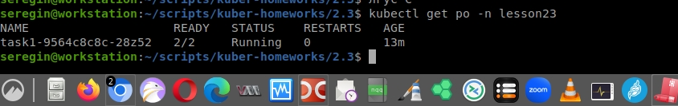
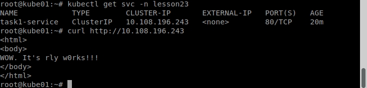
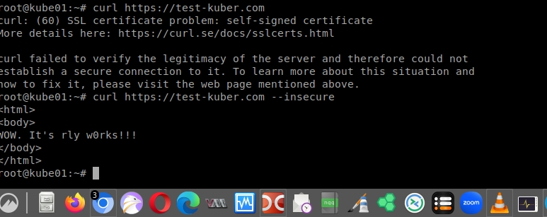
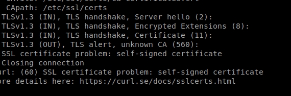

# Домашнее задание к занятию «Конфигурация приложений»

### Цель задания

В тестовой среде Kubernetes необходимо создать конфигурацию и продемонстрировать работу приложения.

------

### Чеклист готовности к домашнему заданию

1. Установленное K8s-решение (например, MicroK8s).
2. Установленный локальный kubectl.
3. Редактор YAML-файлов с подключённым GitHub-репозиторием.

------

### Инструменты и дополнительные материалы, которые пригодятся для выполнения задания

1. [Описание](https://kubernetes.io/docs/concepts/configuration/secret/) Secret.
2. [Описание](https://kubernetes.io/docs/concepts/configuration/configmap/) ConfigMap.
3. [Описание](https://github.com/wbitt/Network-MultiTool) Multitool.

------

### Задание 1. Создать Deployment приложения и решить возникшую проблему с помощью ConfigMap. Добавить веб-страницу

1. Создать Deployment приложения, состоящего из контейнеров nginx и multitool.

>2. Решить возникшую проблему с помощью ConfigMap.

Проблема очевидна - занят порт. Нжинкс не стартует. `kubectl logs task1-8f767887c-92qld -c task1-nginx`

```
2025/03/19 19:53:47 [emerg] 1#1: bind() to 0.0.0.0:80 failed (98: Address already in use)
nginx: [emerg] bind() to 0.0.0.0:80 failed (98: Address already in use)
2025/03/19 19:53:47 [notice] 1#1: try again to bind() after 500ms
```

Добавим конфигмап:

```
apiVersion: v1
kind: ConfigMap
metadata:
  name: multitool-configmap
  namespace: lesson23
data:
  multitool-configmap.port: "8080"
```

И в деплой контейнерра с мультитулом:

```
        env:
        - name: HTTP_PORT
          valueFrom:
            configMapKeyRef:
              name: multitool-configmap
              key: multitool-configmap.port
```

> 3. Продемонстрировать, что pod стартовал и оба конейнера работают.



> 4. Сделать простую веб-страницу и подключить её к Nginx с помощью ConfigMap. Подключить Service и показать вывод curl или в браузере.



5. Предоставить манифесты, а также скриншоты или вывод необходимых команд.

https://github.com/WilderWein123/kuber-homeworks-2.3/blob/master/task1-1.yaml

------

### Задание 2. Создать приложение с вашей веб-страницей, доступной по HTTPS 

1. Создать Deployment приложения, состоящего из Nginx.
2. Создать собственную веб-страницу и подключить её как ConfigMap к приложению.
3. Выпустить самоподписной сертификат SSL. Создать Secret для использования сертификата.

> 4. Создать Ingress и необходимый Service, подключить к нему SSL в вид. Продемонстировать доступ к приложению по HTTPS. 

Так как самоподписный сертификат все равно не является достоверным, curl все равно не пустит нас на страницу без параметра '--insecure':



Сертификат при этом есть:




4. Предоставить манифесты, а также скриншоты или вывод необходимых команд.

https://github.com/WilderWein123/kuber-homeworks-2.3/blob/master/task2.yaml

------

### Правила приёма работы

1. Домашняя работа оформляется в своём GitHub-репозитории в файле README.md. Выполненное домашнее задание пришлите ссылкой на .md-файл в вашем репозитории.
2. Файл README.md должен содержать скриншоты вывода необходимых команд `kubectl`, а также скриншоты результатов.
3. Репозиторий должен содержать тексты манифестов или ссылки на них в файле README.md.

------
